<h1>Crossfire: Custom Matchmaking Algorithms</h1>

<!-- wp:paragraph -->

<a href="../namazu-crossfire">Namazu Crossfire</a> ships two built-in matchmaking algorithms — a FIFO queue and a simple join-code flow — but both matching strategies are pluggable. This page walks through how the built-in algorithms actually work end-to-end, and what you get for free when you write your own (ratings-based matching, party/lobby systems, region-aware pools, and so on).

<!-- /wp:paragraph -->

<!-- wp:paragraph -->

This assumes familiarity with the <a href="../crossfire-protocol-reference">Crossfire Protocol Reference</a>, in particular the four handshake flows (<code>FIND</code>/<code>JOIN</code> vs. <code>CREATE</code>/<code>JOIN_CODE</code>).

<!-- /wp:paragraph -->

<!-- wp:separator -->

<!-- /wp:separator -->

<!-- wp:heading -->
<h2 class="wp-block-heading" id="h-two-algorithm-interfaces">Two algorithm interfaces</h2>
<!-- /wp:heading -->

<!-- wp:paragraph -->

There are two distinct extension points, corresponding to the two handshake flow pairs — they are not variants of each other, and a given implementation only serves one:

<!-- /wp:paragraph -->

<!-- wp:list -->
<ul class="wp-block-list">
<li><strong><code>FindMatchmakingAlgorithm</code></strong> &#8212; serves <code>FIND</code> (<code>initialize</code>) and <code>JOIN</code> (<code>resume</code>). The built-in implementation is <code>FIFOMatchmakingAlgorithm</code>.</li>
<li><strong><code>JoinCodeMatchmakingAlgorithm</code></strong> &#8212; serves <code>CREATE</code> (<code>initialize</code>) and <code>JOIN_CODE</code> (<code>resume</code>). The built-in implementation is <code>SimpleJoinCodeMatchmakingAlgorithm</code>.</li>
</ul>
<!-- /wp:list -->

<!-- wp:paragraph -->

Both extend the common <code>MatchmakingAlgorithm&lt;CreateT, ResumeT&gt;</code> contract:

<!-- /wp:paragraph -->

<!-- wp:list -->
<ul class="wp-block-list">
<li><code>initialize(request)</code> &#8212; called for the "first contact" request (<code>FIND</code> or <code>CREATE</code>). Must be <strong>non-blocking</strong> and return a <code>MatchHandle</code> immediately.</li>
<li><code>resume(request)</code> &#8212; called for a "second contact" request (<code>JOIN</code> or <code>JOIN_CODE</code>). Also non-blocking, also returns a <code>MatchHandle</code>.</li>
</ul>
<!-- /wp:list -->

<!-- wp:heading -->
<h2 class="wp-block-heading" id="h-matchphase-lifecycle">The <code>MatchPhase</code> lifecycle</h2>
<!-- /wp:heading -->

<!-- wp:paragraph -->

Every <code>MatchHandle</code> tracks its own phase, independent of the connection's <code>ConnectionPhase</code>:

<!-- /wp:paragraph -->

<!-- wp:code -->
<pre class="wp-block-code"><code>READY &#8594; MATCHING &#8594; MATCHED &#8594; TERMINATED</code></pre>
<!-- /wp:code -->

<!-- TODO(docs): render source at images/matchphase-lifecycle.mmd, upload the SVG to the WP media library, then replace the src below with the hosted URL -->
<!-- wp:image {"linkDestination":"none"} -->
<figure class="wp-block-image"></figure>
<!-- /wp:image -->

<!-- wp:paragraph -->

<code>TERMINATED</code> is absorbing — every transition first checks for it and no-ops if already there, so a handle can never come back to life once the player has disconnected or left. Transitions are otherwise strict and enforced by the state record itself: <code>startMatching()</code> requires <code>READY</code>, and reporting a result requires <code>MATCHING</code>; calling either out of order throws <code>ProtocolStateException</code> rather than silently doing nothing.

<!-- /wp:paragraph -->

<!-- wp:heading -->
<h2 class="wp-block-heading" id="h-what-abstractmatchhandle-gives-you">What <code>AbstractMatchHandle</code> gives you</h2>
<!-- /wp:heading -->

<!-- wp:paragraph -->

<code>AbstractMatchHandle&lt;RequestT&gt;</code> (in the <code>util</code> module) is the base class every concrete <code>MatchHandle</code> should extend. It owns the <code>MatchPhase</code> state machine in an <code>AtomicReference</code> and turns each public <code>MatchHandle</code> method into a phase-checked dispatch to one of six abstract hooks you implement:

<!-- /wp:paragraph -->

<!-- wp:list -->
<ul class="wp-block-list">
<li><code>onMatching(state)</code> &#8212; do the actual work of finding or creating a match. This is the only hook every algorithm must supply itself; there's no generic implementation of "how do I match."</li>
<li><code>onResult(state, result)</code> &#8212; called once you invoke <code>setResult(...)</code> from within <code>onMatching</code>, completing the handshake.</li>
<li><code>onLeaveMatch(state)</code> &#8212; the player is leaving a match they were already matched into.</li>
<li><code>onOpenMatch(state)</code> / <code>onCloseMatch(state)</code> / <code>onEndMatch(state)</code> &#8212; back the <code>OPEN</code>/<code>CLOSE</code>/<code>END</code> control messages. These don't change <code>MatchPhase</code> themselves — a match can be opened and closed repeatedly while <code>MATCHED</code>.</li>
</ul>
<!-- /wp:list -->

<!-- wp:paragraph -->

Two of these dispatches are worth studying closely, because they demonstrate the <code>updateAndGet</code> vs. <code>getAndUpdate</code> distinction called out in the <a href="../crossfire-protocol-reference#h-implementation-notes">protocol reference</a>:

<!-- /wp:paragraph -->

<!-- wp:list -->
<ul class="wp-block-list">
<li><code>startMatching()</code> uses <strong><code>updateAndGet</code></strong> — it needs the <em>resulting</em> phase to decide whether to actually kick off <code>onMatching</code>, or just log if the handle was already terminated (e.g. the player disconnected before matching started).</li>
<li><code>leaveMatch()</code> uses <strong><code>getAndUpdate</code></strong> — it needs the phase <em>before</em> the termination transition overwrote it, because the cleanup differs: a <code>MATCHED</code> handle has a real match/result to release (<code>onLeaveMatch</code>), while a still-<code>MATCHING</code> handle has nothing to release yet (falls through to a log-only default).</li>
</ul>
<!-- /wp:list -->

<!-- wp:paragraph -->

Inside <code>onMatching</code>, call the protected <code>setResult(MultiMatch)</code> once you've found or created the match — this is what drives the <code>MATCHING &#8594; MATCHED</code> transition and ultimately calls <code>getRequest().success(this)</code>, which is what actually sends the handshake response and moves the connection into <code>SIGNALING</code>.

<!-- /wp:paragraph -->

<!-- wp:heading -->
<h2 class="wp-block-heading" id="h-standardcancelablematchhandle">Skipping the boilerplate with <code>StandardCancelableMatchHandle</code></h2>
<!-- /wp:heading -->

<!-- wp:paragraph -->

<code>StandardCancelableMatchHandle&lt;RequestT&gt;</code> (also in <code>util</code>) implements every hook except <code>onMatching</code> in terms of the standard <code>MultiMatchDao</code> operations, so most custom algorithms only need to extend it and write <code>onMatching</code>:

<!-- /wp:paragraph -->

<!-- wp:list -->
<ul class="wp-block-list">
<li><code>onEndMatch</code> &#8594; <code>dao.endMatch(matchId)</code></li>
<li><code>onCloseMatch</code> &#8594; <code>dao.closeMatch(matchId)</code></li>
<li><code>onOpenMatch</code> &#8594; re-fetches the match, then <code>dao.openMatch(...)</code></li>
<li><code>onLeaveMatch</code> &#8594; <code>dao.removeProfile(matchId, profile)</code>, and deletes the match if that was the last profile</li>
<li><code>onResult</code> &#8594; <code>getRequest().success(this)</code></li>
</ul>
<!-- /wp:list -->

<!-- wp:paragraph -->

Every DAO call in these hooks (other than <code>onOpenMatch</code>) is dispatched via <code>getRequest().getServer().submit(...)</code> so it runs off the calling thread — your <code>onMatching</code> override should follow the same pattern rather than blocking on database access directly.

<!-- /wp:paragraph -->

<!-- wp:heading -->
<h2 class="wp-block-heading" id="h-walkthrough-fifomatchmakingalgorithm">Walkthrough: <code>FIFOMatchmakingAlgorithm</code></h2>
<!-- /wp:heading -->

<!-- wp:paragraph -->

<code>FIFOMatchmakingAlgorithm</code> is the reference implementation to model a new <code>FindMatchmakingAlgorithm</code> on:

<!-- /wp:paragraph -->

<!-- wp:list {"ordered":true} -->
<ol class="wp-block-list">
<li><code>initialize(request)</code> returns a private inner <code>FIFOMatchHandle</code>, extending <code>StandardCancelableMatchHandle&lt;FindHandshakeRequest&gt;</code>.</li>
<li><code>resume(request)</code> returns a plain <code>StandardJoinMatchHandle</code> — a generic, protocol-level handle (not FIFO-specific) that re-looks-up the existing match by ID and verifies the requesting profile is a member. Reconnection logic doesn't depend on how the match was originally formed, so any <code>FindMatchmakingAlgorithm</code> can reuse this class as-is for its <code>resume()</code>.</li>
<li><code>FIFOMatchHandle.onMatching</code> submits work to the server executor: opens a transaction, calls <code>MultiMatchDao.findOldestAvailableMultiMatchCandidate(configuration, profileId, "")</code>; if nothing is available it creates a brand-new <code>OPEN</code> <code>MultiMatch</code>; either way it adds the requesting profile and calls <code>setResult(...)</code>.</li>
</ol>
<!-- /wp:list -->

<!-- wp:paragraph -->

A ratings-based or region-aware algorithm would follow the identical shape — swap step 3's DAO query for your own candidate-selection logic (e.g. querying a rating service and filtering candidates by rating window before falling back to creating a new match).

<!-- /wp:paragraph -->

<!-- wp:heading -->
<h2 class="wp-block-heading" id="h-walkthrough-simplejoincodematchmakingalgorithm">Walkthrough: <code>SimpleJoinCodeMatchmakingAlgorithm</code></h2>
<!-- /wp:heading -->

<!-- wp:paragraph -->

The create/join-code flow differs from FIFO in a few instructive ways:

<!-- /wp:paragraph -->

<!-- wp:list -->
<ul class="wp-block-list">
<li>It exposes two deployment-configurable element attributes — <code>JOIN_CODE_LENGTH</code> (default <code>4</code>) and <code>MAX_ATTEMPTS</code> (default <code>2000</code>) — rather than hardcoding join-code generation parameters.</li>
<li><code>initialize()</code>'s handle creates the match via a join-code-aware DAO overload, <code>dao.createMultiMatch(match, parameters)</code>, where <code>parameters</code> (a <code>UniqueCodeDao.GenerationParameters</code>) carries the code length/attempt budget along with the app config's timeout/linger seconds.</li>
<li>It <strong>overrides <code>newHandshakeResponse()</code></strong> on its handle to return a <code>CreatedHandshakeResponse</code> (populated with <code>matchId</code>, <code>joinCode</code>, <code>profileId</code>) instead of the default <code>MatchedResponse</code>. This is the pattern to copy any time your algorithm needs to hand extra data back to the client in the handshake response — <code>MatchHandle</code>'s default <code>newHandshakeResponse()</code> only returns a bare <code>MatchedResponse</code>.</li>
<li><code>resume()</code> (serving <code>JOIN_CODE</code>) uses <code>StandardJoinCodeMatchHandle</code>, whose <code>onMatching</code> looks the match up by join code (<code>dao.getMultiMatchByJoinCode(...)</code>) and adds the joining profile if it isn't already a member — unlike FIFO, where profile-adding only happens in <code>initialize()</code>, here it can also happen during <code>resume()</code> since that's when a second player actually shows up.</li>
</ul>
<!-- /wp:list -->

<!-- wp:heading -->
<h2 class="wp-block-heading" id="h-registering-your-algorithm">Registering your algorithm</h2>
<!-- /wp:heading -->

<!-- wp:paragraph -->

Export your implementation with <code>@ElementServiceExport</code> and bind it in your Element's Guice module. To make an algorithm selectable by name from a <code>MatchmakingApplicationConfiguration.matchmaker</code> reference (rather than only usable as your Element's default), bind it twice — once unqualified and once under a <code>@Named</code> annotation — following the exact pattern Crossfire itself uses for FIFO and simple join-code:

<!-- /wp:paragraph -->

<!-- wp:code -->
<pre class="wp-block-code"><code>@ElementServiceExport(value = FindMatchmakingAlgorithm.class)
@ElementServiceExport(value = FindMatchmakingAlgorithm.class, name = "RATING_WINDOW")
public class RatingWindowMatchmakingAlgorithm implements FindMatchmakingAlgorithm { /* ... */ }</code></pre>
<!-- /wp:code -->

<!-- wp:code -->
<pre class="wp-block-code"><code>bind(FindMatchmakingAlgorithm.class).to(RatingWindowMatchmakingAlgorithm.class);
bind(FindMatchmakingAlgorithm.class)
    .annotatedWith(named("RATING_WINDOW"))
    .to(RatingWindowMatchmakingAlgorithm.class);
expose(FindMatchmakingAlgorithm.class);
expose(FindMatchmakingAlgorithm.class).annotatedWith(named("RATING_WINDOW"));</code></pre>
<!-- /wp:code -->

<!-- wp:paragraph -->

The unqualified binding becomes the algorithm used whenever a <code>MatchmakingApplicationConfiguration</code> doesn't specify a <code>matchmaker</code>; the named binding is what <code>V1HandshakeHandler.algorithmFromConfiguration()</code> resolves when a configuration explicitly references your algorithm by its <code>ElementServiceReference</code> name — see <a href="../custom-elements">Custom Elements</a> for background on cross-Element service resolution.

<!-- /wp:paragraph -->
