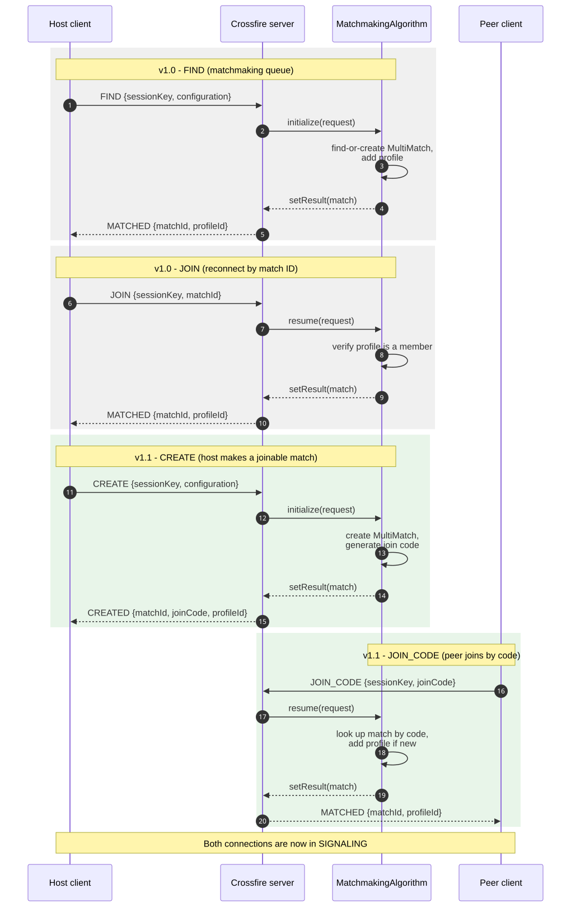
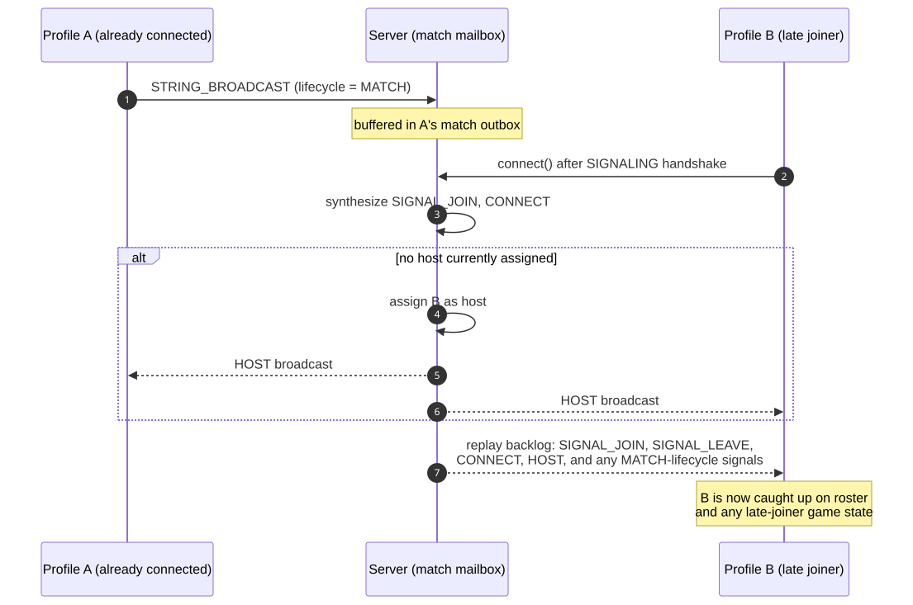

<h1>Crossfire Protocol Reference</h1>

<!-- wp:paragraph -->

This page documents the wire protocol used by <a href="../namazu-crossfire">Namazu Crossfire</a>: the connection state machine, the JSON message envelope, the four handshake flows, the signaling model (direct vs. broadcast signals, backlog/replay, and signal lifecycles), control messages, error handling, and the ping/pong keepalive. It is intended for anyone implementing a Crossfire client from scratch, or extending the server with a <a href="../crossfire-custom-matchmaking-algorithms">custom matchmaking algorithm</a>.

<!-- /wp:paragraph -->

<!-- wp:paragraph -->

If you are integrating an existing client (Unity, JVM, or browser), see <a href="../crossfire-client-libraries">Crossfire Client Libraries</a> instead — this page is for protocol implementers.

<!-- /wp:paragraph -->

<!-- wp:separator -->

<!-- /wp:separator -->

<!-- wp:heading {"anchor":"h-connection-lifecycle"} -->
<h2 id="h-connection-lifecycle" class="wp-block-heading">Connection lifecycle</h2>
<!-- /wp:heading -->

<!-- wp:paragraph -->

Every WebSocket connection to the Crossfire endpoint progresses through a single, one-way state machine:

<!-- /wp:paragraph -->

<!-- wp:code -->
<pre class="wp-block-code"><code>WAITING → READY → HANDSHAKE → SIGNALING → TERMINATED</code></pre>
<!-- /wp:code -->

<!-- TODO(docs): render source at images/connection-lifecycle.mmd, upload the SVG to the WP media library, then replace the src below with the hosted URL (see the pattern used in oidc-login-for-thick-clients-browser-redirect-flow.md) -->

<!-- wp:image {"linkDestination":"none"} -->
<figure class="wp-block-image"></figure>
<!-- /wp:image -->

<!-- wp:list {"className":"wp-block-list"} -->
<ul class="wp-block-list"><!-- wp:list-item -->
<li><strong>WAITING</strong> — the socket has not yet been accepted by the server.</li>
<!-- /wp:list-item -->

<!-- wp:list-item -->
<li><strong>READY</strong> — the connection is open. The client must send a handshake message (<code>FIND</code>, <code>JOIN</code>, <code>CREATE</code>, or <code>JOIN_CODE</code>) as its first message. Any signaling or direct-signaling messages sent this early are buffered rather than rejected, and are replayed once the connection reaches <code>SIGNALING</code>.</li>
<!-- /wp:list-item -->

<!-- wp:list-item -->
<li><strong>HANDSHAKE</strong> — entered as soon as a handshake message is accepted. A second handshake attempt is not allowed; the connection may only enter this phase once. Signaling messages received while still in this phase are also buffered.</li>
<!-- /wp:list-item -->

<!-- wp:list-item -->
<li><strong>SIGNALING</strong> — entered once authentication succeeds <em>and</em> a match has been assigned. From here the client exchanges signals and control messages until the socket closes.</li>
<!-- /wp:list-item -->

<!-- wp:list-item -->
<li><strong>TERMINATED</strong> — absorbing. Once terminated, further inbound messages are logged and dropped rather than causing further errors.</li>
<!-- /wp:list-item --></ul>
<!-- /wp:list -->

<!-- wp:paragraph -->

Any message whose <a href="#h-message-envelope-and-wire-format">category</a> is not valid for the current phase closes the connection with a policy-violation close code and a <code>ProtocolStateException</code>.

<!-- /wp:paragraph -->

<!-- wp:heading {"anchor":"h-message-envelope-and-wire-format"} -->
<h2 id="h-message-envelope-and-wire-format" class="wp-block-heading">Message envelope and wire format</h2>
<!-- /wp:heading -->

<!-- wp:paragraph -->

Every message is a single JSON object with a <code>type</code> discriminator field. The server resolves <code>type</code> against <code>ProtocolMessageType</code> and deserializes the rest of the object into the matching Java class. There is no separate envelope wrapper — the payload fields sit alongside <code>type</code> at the top level. Unknown fields are ignored (the shared Jackson mapper has <code>FAIL_ON_UNKNOWN_PROPERTIES</code> disabled), which keeps the wire format forwards-compatible across minor versions.

<!-- /wp:paragraph -->

<!-- wp:code -->
<pre class="wp-block-code"><code>{
  "type": "STRING_BROADCAST",
  "profileId": "abc123",
  "lifecycle": "SESSION",
  "payload": "hello"
}</code></pre>
<!-- /wp:code -->

<!-- wp:paragraph -->

Binary payloads (<code>BINARY_BROADCAST</code>, <code>BINARY_RELAY</code>) are base64-encoded strings on the wire, per standard Jackson <code>byte[]</code> handling.

<!-- /wp:paragraph -->

<!-- wp:paragraph -->

Each <code>ProtocolMessageType</code> belongs to exactly one <strong>category</strong> (<code>ProtocolMessageCategory</code>), and the connection phase determines which categories are legal to receive:

<!-- /wp:paragraph -->

<!-- wp:table {"hasFixedLayout":false} -->
<figure class="wp-block-table"><table><thead><tr><th>Category</th><th>Used for</th><th>Valid phase</th></tr></thead><tbody><tr><td><code>HANDSHAKE</code></td><td><code>FIND</code>, <code>JOIN</code>, <code>CREATE</code>, <code>JOIN_CODE</code>, <code>CREATED</code>, <code>MATCHED</code></td><td><code>READY</code></td></tr><tr><td><code>SIGNALING</code></td><td>Broadcast signals delivered to every other participant</td><td><code>SIGNALING</code></td></tr><tr><td><code>SIGNALING_DIRECT</code></td><td>Signals addressed to one specific recipient (SDP/ICE exchange, relays)</td><td><code>SIGNALING</code></td></tr><tr><td><code>CONTROL</code></td><td><code>OPEN</code>, <code>CLOSE</code>, <code>END</code>, <code>LEAVE</code></td><td><code>SIGNALING</code></td></tr><tr><td><code>ERROR</code></td><td><code>ERROR</code> (server → client only)</td><td>any phase</td></tr></tbody></table></figure>
<!-- /wp:table -->

<!-- wp:paragraph -->

Some message types are <strong>server-only</strong> (<code>ProtocolMessage.isServerOnly()</code> returns <code>true</code>) — for example <code>MATCHED</code> and all server-driven presence signals (<code>CONNECT</code>, <code>DISCONNECT</code>, <code>HOST</code>, <code>SIGNAL_JOIN</code>, <code>SIGNAL_LEAVE</code>). If a client sends one of these, the server rejects it with an <code>INVALID_MESSAGE</code> error and closes the connection.

<!-- /wp:paragraph -->

<!-- wp:heading {"anchor":"h-protocol-versions"} -->
<h2 id="h-protocol-versions" class="wp-block-heading">Protocol versions</h2>
<!-- /wp:heading -->

<!-- wp:paragraph -->

Crossfire currently defines two protocol versions, negotiated per-connection by the <code>version</code> field of the handshake request:

<!-- /wp:paragraph -->

<!-- wp:list {"className":"wp-block-list"} -->
<ul class="wp-block-list"><!-- wp:list-item -->
<li><strong><code>V_1_0</code></strong> — the original handshake flows: <code>FIND</code> (matchmaking queue) and <code>JOIN</code> (join/resume by match ID). All signaling, control, and error message types are also <code>V_1_0</code>.</li>
<!-- /wp:list-item -->

<!-- wp:list-item -->
<li><strong><code>V_1_1</code></strong> — adds the create/join-code flow: <code>CREATE</code> and <code>JOIN_CODE</code>, plus the <code>CREATED</code> response.</li>
<!-- /wp:list-item --></ul>
<!-- /wp:list -->

<!-- wp:paragraph -->

A version is compatible with a request if the major versions match and the server/session version's minor is greater than or equal to the requested minor (<code>Version.isCompatibleWithRequestedVersion</code>). The server routes each handshake request to a dedicated handler based on the version: <code>V10HandshakeHandler</code> only understands <code>FIND</code>/<code>JOIN</code>, while <code>V11HandshakeHandler</code> only understands <code>CREATE</code>/<code>JOIN_CODE</code>. Both extend the shared <code>V1HandshakeHandler</code> base, which manages authentication and the handshake-internal state machine (<code>READY → AUTHENTICATING → AUTHENTICATED → MATCHING → TERMINATED</code>) common to all four flows.

<!-- /wp:paragraph -->

<!-- wp:heading {"anchor":"h-the-four-handshake-flows"} -->
<h2 id="h-the-four-handshake-flows" class="wp-block-heading">The four handshake flows</h2>
<!-- /wp:heading -->

<!-- wp:paragraph -->

Every flow follows the same shape: client sends a handshake request → server authenticates the session/profile → server resolves a <code>MatchmakingAlgorithm</code> (default, or named via the application's <code>MatchmakingApplicationConfiguration.matchmaker</code>) → the algorithm asynchronously matches or creates → server sends a handshake response → connection transitions to <code>SIGNALING</code>.

<!-- /wp:paragraph -->

<!-- TODO(docs): render source at images/handshake-flows.mmd, upload the SVG to the WP media library, then replace the src below with the hosted URL -->

<!-- wp:image {"linkDestination":"none"} -->
<figure class="wp-block-image"></figure>
<!-- /wp:image -->

<!-- wp:image {"sizeSlug":"large"} -->
<figure class="wp-block-image size-large"></figure>
<!-- /wp:image -->

<!-- wp:heading {"level":3,"anchor":"h-find-v1-0-join-the-matchmaking-queue"} -->
<h3 id="h-find-v1-0-join-the-matchmaking-queue" class="wp-block-heading">FIND (v1.0) — join the matchmaking queue</h3>
<!-- /wp:heading -->

<!-- wp:paragraph -->

Request (<code>FindHandshakeRequest</code>): <code>type: "FIND"</code>, <code>version</code>, <code>sessionKey</code> (required), <code>profileId</code> (optional — falls back to the profile attached to the session), <code>configuration</code> (required — the name of the <code>MatchmakingApplicationConfiguration</code> to use).

<!-- /wp:paragraph -->

<!-- wp:paragraph -->

The server resolves the named <code>FindMatchmakingAlgorithm</code> and calls <code>initialize(request)</code>, which is expected to find-or-create a <code>MultiMatch</code> and add the profile to it. Response: <code>MatchedResponse</code> (<code>type: "MATCHED"</code>, <code>matchId</code>, <code>profileId</code>).

<!-- /wp:paragraph -->

<!-- wp:heading {"level":3,"anchor":"h-join-v1-0-rejoin-a-known-match"} -->
<h3 id="h-join-v1-0-rejoin-a-known-match" class="wp-block-heading">JOIN (v1.0) — rejoin a known match</h3>
<!-- /wp:heading -->

<!-- wp:paragraph -->

Request (<code>JoinHandshakeRequest</code>): <code>type: "JOIN"</code>, <code>version</code>, <code>sessionKey</code>, <code>matchId</code> (required), <code>profileId</code> (optional). Used to reconnect after a disconnection or network interruption — the client already knows its match ID.

<!-- /wp:paragraph -->

<!-- wp:paragraph -->

The server looks up the match's own <code>MatchmakingApplicationConfiguration</code> (so the join uses the same algorithm the match was created under), then calls the algorithm's <code>resume(request)</code>, which verifies the requesting profile is actually a member of the match before returning a handle. Response: <code>MatchedResponse</code>.

<!-- /wp:paragraph -->

<!-- wp:heading {"level":3,"anchor":"h-create-v1-1-create-a-joinable-match"} -->
<h3 id="h-create-v1-1-create-a-joinable-match" class="wp-block-heading">CREATE (v1.1) — create a joinable match</h3>
<!-- /wp:heading -->

<!-- wp:paragraph -->

Request (<code>CreateHandshakeRequest</code>): <code>type: "CREATE"</code>, <code>version</code> (defaults to <code>V_1_1</code>), <code>sessionKey</code>, <code>profileId</code>, <code>configuration</code> (required).

<!-- /wp:paragraph -->

<!-- wp:paragraph -->

Resolves a <code>JoinCodeMatchmakingAlgorithm</code> and calls <code>initialize(request)</code>, which creates the match and generates a join code. Response: <code>CreatedHandshakeResponse</code> (<code>type: "CREATED"</code>, <code>matchId</code>, <code>joinCode</code>, <code>profileId</code>) — the join code is the piece of data a game would show the host to share with other players.

<!-- /wp:paragraph -->

<!-- wp:heading {"level":3,"anchor":"h-join-code-v1-1-join-by-code"} -->
<h3 id="h-join-code-v1-1-join-by-code" class="wp-block-heading">JOIN_CODE (v1.1) — join by code</h3>
<!-- /wp:heading -->

<!-- wp:paragraph -->

Request (<code>JoinCodeHandshakeRequest</code>): <code>type: "JOIN_CODE"</code>, <code>version</code>, <code>sessionKey</code>, <code>joinCode</code> (required), <code>profileId</code>.

<!-- /wp:paragraph -->

<!-- wp:paragraph -->

The server looks the match up by join code, resolves the same <code>JoinCodeMatchmakingAlgorithm</code> the match was created with, and calls <code>resume(request)</code>, which adds the joining profile to the match if it isn't already a member. Response: <code>MatchedResponse</code> (not <code>CreatedHandshakeResponse</code> — only the creator receives the join code back; subsequent joiners already know it).

<!-- /wp:paragraph -->

<!-- wp:paragraph -->

All four flows are pluggable — see <a href="../crossfire-custom-matchmaking-algorithms">Custom Matchmaking Algorithms</a> for how to replace the default FIFO/join-code implementations with your own matching, rating, or lobby logic.

<!-- /wp:paragraph -->

<!-- wp:heading {"anchor":"h-signaling-phase"} -->
<h2 id="h-signaling-phase" class="wp-block-heading">Signaling phase</h2>
<!-- /wp:heading -->

<!-- wp:paragraph -->

Once a connection enters <code>SIGNALING</code>, the server sends the <a href="#h-the-four-handshake-flows">handshake response</a> and then joins the connection to the match's in-memory mailbox. From this point, three kinds of traffic flow over the socket: <strong>broadcast signals</strong>, <strong>direct signals</strong>, and <strong>control messages</strong>.

<!-- /wp:paragraph -->

<!-- wp:heading {"level":3,"anchor":"h-broadcast-vs-direct-signals"} -->
<h3 id="h-broadcast-vs-direct-signals" class="wp-block-heading">Broadcast vs. direct signals</h3>
<!-- /wp:heading -->

<!-- wp:paragraph -->

A <strong>broadcast signal</strong> (<code>BroadcastSignal</code>) is delivered to every other participant in the match except the sender. Client-originated broadcast types are <code>STRING_BROADCAST</code> and <code>BINARY_BROADCAST</code> (arbitrary game data). Server-originated ("server-only") broadcast types report match presence: <code>CONNECT</code>, <code>DISCONNECT</code>, <code>HOST</code>, <code>SIGNAL_JOIN</code>, <code>SIGNAL_LEAVE</code>.

<!-- /wp:paragraph -->

<!-- wp:paragraph -->

A <strong>direct signal</strong> (<code>DirectSignal</code>) is addressed to exactly one recipient profile via <code>recipientProfileId</code>, and it is a protocol error (<code>UnexpectedMessageException</code>) to address one to yourself. This is the category used for WebRTC negotiation: <code>SDP_OFFER</code>, <code>SDP_ANSWER</code>, and <code>CANDIDATE</code> (ICE candidates, carrying <code>mid</code>/<code>midIndex</code>/<code>candidate</code>). It's also used for point-to-point application data that shouldn't go to the whole match: <code>STRING_RELAY</code>, <code>BINARY_RELAY</code>.

<!-- /wp:paragraph -->

<!-- wp:paragraph -->

The server validates both sender and recipient (for direct signals) are actual members of the match before delivering; an unknown profile ID results in a <code>ForbiddenException</code>.

<!-- /wp:paragraph -->

<!-- wp:heading {"level":3,"anchor":"h-signal-lifecycle-once-session-match"} -->
<h3 id="h-signal-lifecycle-once-session-match" class="wp-block-heading">Signal lifecycle: ONCE, SESSION, MATCH</h3>
<!-- /wp:heading -->

<!-- wp:paragraph -->

Every signal declares a <code>SignalLifecycle</code> that controls whether — and for how long — the server buffers it for replay to clients that connect or reconnect later:

<!-- /wp:paragraph -->

<!-- wp:list {"className":"wp-block-list"} -->
<ul class="wp-block-list"><!-- wp:list-item -->
<li><strong><code>ONCE</code></strong> — fire-and-forget. Delivered only to currently-connected recipients; never buffered. If nobody is listening at the moment it's sent, it's lost. Default lifecycle for <code>STRING_BROADCAST</code>, <code>BINARY_BROADCAST</code>, <code>STRING_RELAY</code>, <code>BINARY_RELAY</code>, and the server's <code>DISCONNECT</code> signal (a disconnect notice from five minutes ago isn't useful to a new joiner).</li>
<!-- /wp:list-item -->

<!-- wp:list-item -->
<li><strong><code>SESSION</code></strong> — buffered for the lifetime of the sender's current connection; cleared as soon as that connection's subscription disconnects. Used for <code>CONNECT</code>, <code>HOST</code>, and the WebRTC negotiation signals <code>SDP_OFFER</code>/<code>SDP_ANSWER</code>/<code>CANDIDATE</code> — if a peer drops mid-negotiation, that negotiation state should not survive to a fresh connection; the spec notes a dropped peer should force a fresh SDP offer rather than replay the stale one.</li>
<!-- /wp:list-item -->

<!-- wp:list-item -->
<li><strong><code>MATCH</code></strong> — buffered for the entire life of the match, replayed to every new joiner regardless of when they connect. Used for <code>SIGNAL_JOIN</code>/<code>SIGNAL_LEAVE</code> (so a late joiner sees the full roster history) and available as an option on <code>StringBroadcastSignal</code>/<code>BinaryBroadcastSignal</code>/<code>StringRelayDirectSignal</code>/<code>BinaryRelayDirectSignal</code> for game data a late joiner needs (e.g. authoritative game state snapshots).</li>
<!-- /wp:list-item --></ul>
<!-- /wp:list -->

<!-- wp:paragraph -->

When implementing a new signal type of your own (via a custom control flow or algorithm), choose <code>MATCH</code> if late-joining players need the information and <code>SESSION</code> if it's transient per-connection state; reach for <code>ONCE</code> only for data with no replay value.

<!-- /wp:paragraph -->

<!-- wp:heading {"level":3,"anchor":"h-backlog-and-replay-for-late-joiners"} -->
<h3 id="h-backlog-and-replay-for-late-joiners" class="wp-block-heading">Backlog and replay for late joiners</h3>
<!-- /wp:heading -->

<!-- wp:paragraph -->

Each match keeps one bounded outbox per profile, split into a <code>match</code> list (holds <code>MATCH</code>-lifecycle signals) and a <code>session</code> list (holds <code>SESSION</code>-lifecycle signals). Outboxes are bounded (<code>elements.crossfire.match.signaling.max.backlog.size</code>, default <strong>256</strong> entries total across the match) — exceeding it raises a <code>MessageBufferOverrunException</code> and terminates the connection, so don't lean on <code>MATCH</code>-lifecycle broadcasts as an unbounded event log.

<!-- /wp:paragraph -->

<!-- wp:paragraph -->

When a profile first joins a match, the server synthesizes and buffers a <code>SIGNAL_JOIN</code> for it. When a connection attaches (<code>connect()</code>), the server synthesizes and buffers a <code>CONNECT</code> signal, assigns that profile as host if no host currently exists (broadcasting <code>HOST</code>), and then replays <em>every</em> signal across <em>every</em> profile's outbox that <code>isFor()</code> the connecting profile — this is how a client that reconnects mid-match catches up on roster state and any in-flight game state without having missed it. If a second connection attempt comes in for a profile that's already connected, the existing subscription is force-disconnected with a <code>DuplicateConnectionException</code> before the new one takes over, guaranteeing at most one live connection per profile per match.

<!-- /wp:paragraph -->

<!-- wp:paragraph -->

If the host's connection disconnects cleanly, the server automatically reassigns host to another currently-connected participant and re-broadcasts <code>HOST</code>. If every participant disconnects (but the match record itself isn't ended), or every participant formally leaves the match, the server ends and removes the match automatically.

<!-- /wp:paragraph -->

<!-- TODO(docs): render source at images/backlog-replay.mmd, upload the SVG to the WP media library, then replace the src below with the hosted URL -->

<!-- wp:image {"linkDestination":"none"} -->
<figure class="wp-block-image"></figure>
<!-- /wp:image -->

<!-- wp:heading {"anchor":"h-control-messages"} -->
<h2 id="h-control-messages" class="wp-block-heading">Control messages</h2>
<!-- /wp:heading -->

<!-- wp:paragraph -->

Control messages manage the match itself rather than carrying game data. All are client-originated (there is no server-originated control message):

<!-- /wp:paragraph -->

<!-- wp:table {"hasFixedLayout":false} -->
<figure class="wp-block-table"><table><thead><tr><th>Type</th><th>Host-only?</th><th>Effect</th><th>Connection result</th></tr></thead><tbody><tr><td><code>OPEN</code></td><td>Yes</td><td>Re-opens the match to new participants</td><td>connection stays open</td></tr><tr><td><code>CLOSE</code></td><td>Yes</td><td>Closes the match to new participants (existing participants unaffected)</td><td>connection stays open</td></tr><tr><td><code>END</code></td><td>Yes</td><td>Ends the match entirely</td><td>connection stays open</td></tr><tr><td><code>LEAVE</code></td><td>No</td><td>Removes the sending profile from the match (and deletes the match if it was the last profile)</td><td>connection is closed by the server</td></tr></tbody></table></figure>
<!-- /wp:table -->

<!-- wp:paragraph -->

"Host-only" messages are not currently rejected server-side based on sender identity in the base control service — enforcing that only the host profile may send <code>OPEN</code>/<code>CLOSE</code>/<code>END</code> is the responsibility of a <code>ControlService</code> implementation if you replace the default, or of the game client's own UI logic.

<!-- /wp:paragraph -->

<!-- wp:heading {"anchor":"h-error-handling"} -->
<h2 id="h-error-handling" class="wp-block-heading">Error handling</h2>
<!-- /wp:heading -->

<!-- wp:paragraph -->

Protocol-level errors are delivered as a single <code>ERROR</code> message (<code>StandardProtocolError</code>: <code>code</code> + human-readable <code>message</code>) immediately before the server closes the WebSocket. There is no error recovery within a connection — every error is terminal for that socket; the client must reconnect (typically via <code>JOIN</code> or <code>JOIN_CODE</code>) to resume.

<!-- /wp:paragraph -->

<!-- wp:paragraph -->

Built-in error codes (<code>ProtocolError.Code</code>): <code>UNKNOWN</code>, <code>TIMEOUT</code>, <code>INVALID_MESSAGE</code>. Domain exceptions from the wider Elements SDK (<code>BaseException</code> subclasses — e.g. <code>ForbiddenException</code>, <code>MultiMatchNotFoundException</code>) are mapped through their own <code>getCode()</code> value instead. The WebSocket close code sent alongside the error depends on the exception type:

<!-- /wp:paragraph -->

<!-- wp:list {"className":"wp-block-list"} -->
<ul class="wp-block-list"><!-- wp:list-item -->
<li><code>TimeoutException</code> → <code>GOING_AWAY</code></li>
<!-- /wp:list-item -->

<!-- wp:list-item -->
<li><code>ProtocolStateException</code>, <code>UnexpectedMessageException</code>, <code>MessageBufferOverrunException</code> → <code>VIOLATED_POLICY</code></li>
<!-- /wp:list-item -->

<!-- wp:list-item -->
<li>Other <code>BaseException</code>s → <code>TRY_AGAIN_LATER</code> for an <code>OVERLOAD</code> code, <code>VIOLATED_POLICY</code> otherwise</li>
<!-- /wp:list-item -->

<!-- wp:list-item -->
<li>Anything else → <code>UNEXPECTED_CONDITION</code></li>
<!-- /wp:list-item --></ul>
<!-- /wp:list -->

<!-- wp:heading {"anchor":"h-ping-pong-keepalive"} -->
<h2 id="h-ping-pong-keepalive" class="wp-block-heading">Ping/pong keepalive</h2>
<!-- /wp:heading -->

<!-- wp:paragraph -->

The server drives keepalive, not the client. On connection start it sets the WebSocket session's max idle timeout and schedules a native WebSocket ping on a fixed delay:

<!-- /wp:paragraph -->

<!-- wp:list {"className":"wp-block-list"} -->
<ul class="wp-block-list"><!-- wp:list-item -->
<li><code>dev.getelements.elements.ping.interval.seconds</code> — how often the server pings (default <strong>30</strong>s).</li>
<!-- /wp:list-item -->

<!-- wp:list-item -->
<li><code>dev.getelements.elements.timeout.seconds</code> — the session's max idle timeout (default <strong>90</strong>s); if no traffic (including pong replies) is seen within this window, the container closes the socket.</li>
<!-- /wp:list-item --></ul>
<!-- /wp:list -->

<!-- wp:paragraph -->

A pong reply resets container-level idle tracking automatically; the server does not otherwise track missed pongs itself. If sending a ping fails outright (e.g. the socket is already broken), the server proactively closes the session with an <code>UNEXPECTED_CONDITION</code> close code rather than waiting for the idle timeout.

<!-- /wp:paragraph -->

<!-- wp:heading {"anchor":"h-implementation-notes"} -->
<h2 id="h-implementation-notes" class="wp-block-heading">Implementation notes</h2>
<!-- /wp:heading -->

<!-- wp:paragraph -->

The project's internal engineering notes flag a historical race condition in the handshake shutdown path — using <code>updateAndGet</code> where <code>getAndUpdate</code> was needed, which could miss cancelling in-flight matchmaking work. As of this writing, <code>V1HandshakeHandler.stop()</code> correctly uses <code>getAndUpdate(V1HandshakeStateRecord::terminate)</code> and inspects the <em>previous</em> phase to decide whether to cancel a still-<code>MATCHING</code> handle, so this particular path is implemented correctly. If you're implementing your own <code>MatchHandle</code> subclass, <code>AbstractMatchHandle.leaveMatch()</code> (in the <code>util</code> module) is the canonical example of this pattern: it uses <code>getAndUpdate</code> specifically so it can act on the match's state <em>before</em> the termination transition overwrote it.

<!-- /wp:paragraph -->
