<h1>Common Agent Tasks</h1>

<!-- wp:paragraph -->

This page walks through the everyday workflow of working with the <a href="namazu-agent">Namazu Agent</a>: starting a session in Namazu Cloud, connecting it to GitHub, setting up your workspace, previewing changes on a temporary instance, and finally moving your game to production. It is the practical companion to the overview, which explains what the agent is and why you would use one.

<!-- /wp:paragraph -->

<!-- wp:separator -->

<!-- /wp:separator -->

<!-- wp:heading -->
<h2 class="wp-block-heading" id="h-the-development-workflow-at-a-glance">The Development Workflow at a Glance</h2>
<!-- /wp:heading -->

<!-- wp:paragraph -->

You and the agent work in a loop. You do the parts that need taste and judgment, the agent does the parts that need code slinging, and GitHub is the handoff point between you.

<!-- /wp:paragraph -->

<!-- TODO(docs): render source at images/namazu-agent-workflow.mmd, upload the SVG to the WP media library, then replace the src below with the hosted URL -->
<figure class="wp-block-image"></figure>

<!-- wp:list {"ordered":true} -->
<ol class="wp-block-list"><!-- wp:list-item -->
<li>Start a session in Namazu Cloud</li>
<!-- /wp:list-item -->

<!-- wp:list-item -->
<li>Authenticate with GitHub</li>
<!-- /wp:list-item -->

<!-- wp:list-item -->
<li>Have the agent set up the workspace so it can push and pull your game's code from GitHub</li>
<!-- /wp:list-item -->

<!-- wp:list-item -->
<li>Ask it to set up a temporary instance of Namazu Elements, a copy of your main production instance, to preview against</li>
<!-- /wp:list-item -->

<!-- wp:list-item -->
<li>Iterate: the agent pushes code changes to GitHub for you, you pull them locally, add art, review, test, and adjust, then push back</li>
<!-- /wp:list-item -->

<!-- wp:list-item -->
<li>When you are satisfied, ask the agent to move your game to production</li>
<!-- /wp:list-item --></ol>
<!-- /wp:list -->

<!-- wp:separator -->

<!-- /wp:separator -->

<!-- wp:heading -->
<h2 class="wp-block-heading" id="h-starting-a-session">Starting a Session</h2>
<!-- /wp:heading -->

<!-- wp:paragraph -->

Begin from the Namazu Cloud control panel by launching an agent session. Under the hood this dispatches a job via <a href="namazu-conductor">Namazu Conductor</a>, which starts the agent's execution environment in its own workspace and wires up the terminal you interact with in the dashboard. You do not need to provision anything yourself; starting the session is all it takes.

<!-- /wp:paragraph -->

<!-- wp:heading {"level":3} -->
<h3 class="wp-block-heading" id="h-first-run-onboarding">First-Run Onboarding</h3>
<!-- /wp:heading -->

<!-- wp:paragraph -->

On its very first run in a fresh workspace, the agent walks you through a short onboarding flow instead of dropping you into a blank prompt. Expect a handful of questions, such as whether you are starting a new or existing project, which game engine or client framework you're using, and where the project's source lives. Answer them, and the agent sets up accordingly.

<!-- /wp:paragraph -->

<!-- wp:heading {"level":3} -->
<h3 class="wp-block-heading" id="h-authenticate-with-github">Authenticate with GitHub</h3>
<!-- /wp:heading -->

<!-- wp:paragraph -->

The agent pushes and pulls code for you, so it needs access to your GitHub account. It runs <code>gh auth login</code> as part of startup, and you complete the sign-in that it prompts you for, usually via a device code or a link to open. This is where the agent gets permission to clone your repos, commit, push, and open pull requests on your behalf. Because the running container is disposable (see Session Persistence below), you may need to sign in again at the start of a fresh session.

<!-- /wp:paragraph -->

<!-- wp:heading {"level":3} -->
<h3 class="wp-block-heading" id="h-set-up-your-workspace">Set Up Your Workspace</h3>
<!-- /wp:heading -->

<!-- wp:paragraph -->

Ask the agent to pull your game's code into the workspace, or to scaffold a new project, and it sets up the whole structure: the server-side Elements project, the client or game code, and the reference material it bases its work on. From then on the workspace is the agent's working copy, with GitHub as the bridge to your own machine.

<!-- /wp:paragraph -->

<!-- wp:separator -->

<!-- /wp:separator -->

<!-- wp:heading -->
<h2 class="wp-block-heading" id="h-temporary-preview-instance">Temporary Preview Instance</h2>
<!-- /wp:heading -->

<!-- wp:paragraph -->

Before anything touches a real deployment, ask the agent to set up a temporary instance of Namazu Elements: a disposable preview running its own copy of your project's backend and database, separate from your main production instance. It gets its own externally browsable URL, so you and the agent can verify changes live without any risk to production. When you are done with it, the agent tears it down.

<!-- /wp:paragraph -->

<!-- wp:separator -->

<!-- /wp:separator -->

<!-- wp:heading -->
<h2 class="wp-block-heading" id="h-the-core-iteration-loop">The Core Iteration Loop</h2>
<!-- /wp:heading -->

<!-- wp:paragraph -->

Day to day, you and the agent move in a loop that keeps the actual game-making on your machine:

<!-- /wp:paragraph -->

<!-- wp:list {"ordered":true} -->
<ol class="wp-block-list"><!-- wp:list-item -->
<li>The agent writes or changes code and pushes it to GitHub for you</li>
<!-- /wp:list-item -->

<!-- wp:list-item -->
<li>You pull that branch on your local machine</li>
<!-- /wp:list-item -->

<!-- wp:list-item -->
<li>You add your art, review the code, test it locally, and make adjustments</li>
<!-- /wp:list-item -->

<!-- wp:list-item -->
<li>You push your changes back to GitHub</li>
<!-- /wp:list-item -->

<!-- wp:list-item -->
<li>The agent picks up the changes and continues</li>
<!-- /wp:list-item --></ol>
<!-- /wp:list -->

<!-- wp:paragraph -->

You never hand a zip over a chat window, and the agent never works on a different copy than you do. GitHub is the single shared source of truth between you.

<!-- /wp:paragraph -->

<!-- wp:heading {"level":3} -->
<h3 class="wp-block-heading" id="h-moving-to-production">Moving to Production</h3>
<!-- /wp:heading -->

<!-- wp:paragraph -->

When you are satisfied with a change, ask the agent to move your game to production. The agent deploys the verified work to your real, running instance as a live upgrade. Confirm that is what you want explicitly for that specific change; the agent treats a deploy to production as a one-way door and only does it on your clear go-ahead, not on a general okay from earlier in the conversation.

<!-- /wp:paragraph -->

<!-- wp:separator -->

<!-- /wp:separator -->

<!-- wp:heading -->
<h2 class="wp-block-heading" id="h-session-persistence">Session Persistence</h2>
<!-- /wp:heading -->

<!-- wp:paragraph -->

Two very different things survive between sessions:

<!-- /wp:paragraph -->

<!-- wp:list -->
<ul class="wp-block-list"><!-- wp:list-item -->
<li><strong>The project workspace persists.</strong> The workspace that holds your repos and working files is kept across separate sessions, so you do not have to rebuild your project each time you start a session.</li>
<!-- /wp:list-item -->

<!-- wp:list-item -->
<li><strong>The running container is fresh every time.</strong> Each session runs in a new, disposable execution environment. Anything that lives only inside that container, such as a logged-in state stored in the container's own filesystem, does not survive between sessions. GitHub and other provider sign-ins are the practical case: you will usually sign in again at the start of each session rather than being silently carried over.</li>
<!-- /wp:list-item --></ul>
<!-- /wp:list -->

<!-- wp:separator -->

<!-- /wp:separator -->

<!-- wp:heading -->
<h2 class="wp-block-heading" id="h-idle-timeout-and-notifications">Idle Timeout and Notifications</h2>
<!-- /wp:heading -->

<!-- wp:paragraph -->

A session that is dispatched but not actively used winds itself down automatically after a period of inactivity, so leaving a tab open does not leave the meter running. You can also stop a session manually from the control panel at any time. Each session is a per-job compute cost, not a standing service, so only start one when you actually need it.

<!-- /wp:paragraph -->

<!-- wp:paragraph -->

While a session is running, the agent does not just print text and hope you are watching. When it finishes a long task, gets blocked on a decision only you can make, or needs to hand over a link or a credential, it surfaces a toast notification in the dashboard to get your attention. Keep an eye on those toasts; they are how the agent asks you to weigh in between its own turns.

<!-- /wp:paragraph -->

<!-- wp:separator -->

<!-- /wp:separator -->

<!-- wp:heading -->
<h2 class="wp-block-heading" id="h-related-pages">Related Pages</h2>
<!-- /wp:heading -->

<!-- wp:list -->
<ul class="wp-block-list"><!-- wp:list-item -->
<li><a href="namazu-agent">Namazu Agent</a>: what the agent is, the agent variants, model options, and how sessions run</li>
<!-- /wp:list-item -->

<!-- wp:list-item -->
<li><a href="namazu-conductor">Namazu Conductor</a>: the orchestration engine that dispatches and manages agent sessions</li>
<!-- /wp:list-item -->

<!-- wp:list-item -->
<li><a href="deploying-an-element">Deploying an Element</a>: what a deployable Element looks like when you promote work to production</li>
<!-- /wp:list-item --></ul>
<!-- /wp:list -->
